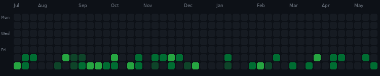

<h1 align="center">Hi, I'm Rohan Akhoundi 👋</h1>

  <b>Backend Developer</b>

  
  &nbsp;
  

---

## 🧑‍💻 About Me

Backend Developer with **4–5 years of experience** designing, developing, and deploying efficient software solutions.
I specialize in **Laravel / PHP** backend systems, performance optimization, and major version upgrades.
I enjoy working on modular architectures, clean APIs, and reliable infrastructure.

---

## 🛠️ Tech Stack

### Languages & Frameworks

  &nbsp;
  &nbsp;
  &nbsp;
  &nbsp;
  &nbsp;
  

### Databases & Caching

  &nbsp;
  &nbsp;
  

### Infrastructure & DevOps

  &nbsp;
  &nbsp;
  &nbsp;
  

### Monitoring & Observability

  &nbsp;
  &nbsp;
  

---

## 📈 GitHub Stats

  

